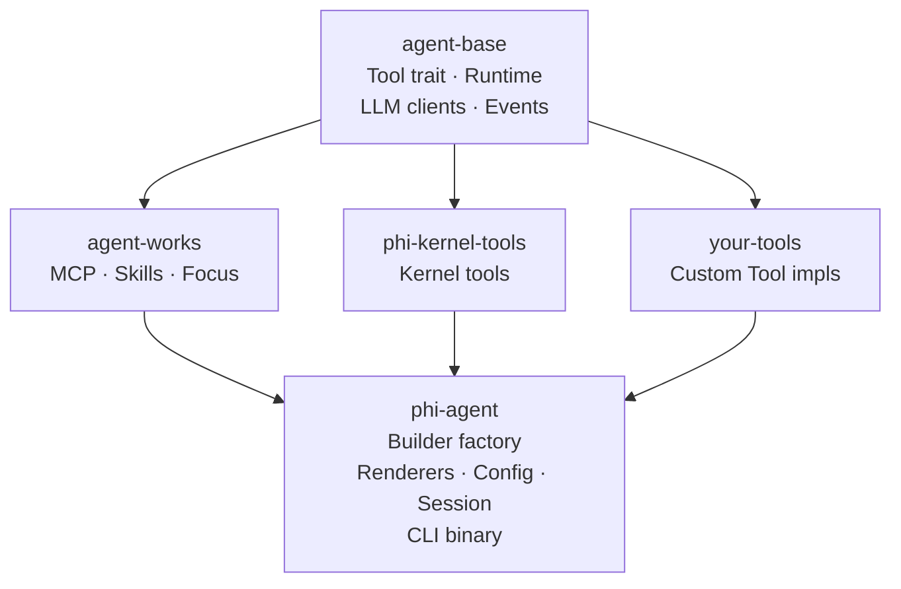

# <picture><source media="(prefers-color-scheme: dark)" srcset="assets/logo.svg"></picture>

[](https://github.com/hibuka-labs/phi-agent/actions)
[](https://crates.io/crates/phi-agent)
[](https://docs.rs/phi-agent)
[](https://codecov.io/gh/hibuka-labs/phi-agent)
[](https://opensource.org/licenses/MIT)
[](https://docs.phiagent.dev)
[](https://pypi.org/project/phi-agent/)

Rust AI Agent runtime framework — orchestration, sessions, streaming all built-in. You only define tools, prompts, and domain knowledge.

> **phi-agent ships with zero application tools.** No web search, no database connector, no code executor — just a clean Rust runtime. What tools your agent needs is entirely up to you. Kernel primitives (file I/O, shell, sub-agents) are available via `phi-kernel-tools` as opt-in infrastructure behind feature flags. File tools and MCP are on by default; shell and multi-agent are opt-in.

Built on [agent-base](https://crates.io/crates/agent-base) and [agent-works](https://crates.io/crates/agent-works). **phi-agent provides the infrastructure. You bring the tools.**

## Ecosystem

| Crate | crates.io | Description |
|-------|-----------|-------------|
| `agent-base` | [](https://crates.io/crates/agent-base) | Lightweight runtime kernel — LLM clients, Tool trait, event stream |
| `agent-works` | [](https://crates.io/crates/agent-works) | Batteries-included toolbox — MCP, Skills, Focus |
| `phi-agent` | [](https://crates.io/crates/phi-agent) | Full framework — Builder factory, renderers, config, CLI binary |

**Just need the runtime?** `cargo add agent-base`. **Want the full framework?** `cargo add phi-agent`.

## Architecture



### Kernel Tools & Protocols

All opt-in via feature flags. `file` and `mcp` are enabled by default; `shell` and `multi-agent` are off.

| Feature | Capability | Default |
|---------|------------|---------|
| `file` | Read, write, list files + skills | **On** |
| `mcp` | Model Context Protocol support | **On** |
| `shell` | Execute shell commands | Off |
| `multi-agent` | Spawn sub-agents | Off |
| `browser` | Browser automation via CDP | Off |

**Feature groups** (convenience bundles):

| Group | Includes | In `full`? |
|-------|----------|------------|
| `protocol` | `mcp` | Yes |
| `observability` | `telemetry` + `logging` | Yes |
| `app` | `browser` | **No** |
| `full` | `file` + `shell` + `mcp` + `telemetry` + `logging` | — |

`telemetry` and `logging` are in the default set. `app` (browser) is intentionally excluded from `full` — add it explicitly when needed. `multi-agent` is always opt-in, not included in any group.

## Why phi-agent

**Your domain, your rules.** Agent loop, session management, streaming events, tool routing, approval hooks — the framework does it all. You write zero glue code and focus on domain logic.

**Single binary.** Compile to one file, drop it in, run it. `cargo install phi-agent` — that's it.

**Every step auditable.** Every LLM call, every tool execution, recorded as JSONL. Sessions are snapshot-able, behavior is traceable, issues are debuggable.

## Quick Start

```rust
use phi_agent::{
    base_agent_builder, build_system_prompt, PhiAgent, PhiAgentConfig,
    OpenAiClient, SafetyConfig, ReasoningEffort,
};
use std::sync::Arc;

#[tokio::main]
async fn main() -> anyhow::Result<()> {
    let llm_client = Arc::new(OpenAiClient::new(
        std::env::var("LLM_API_KEY")?,
        "gpt-4o".into(),
        Some("https://api.openai.com/v1".into()),
    ));

    let builder = base_agent_builder(llm_client)
        .system_prompt(build_system_prompt())
        .register_tool(your_tool);

    let agent = PhiAgent::build(builder, PhiAgentConfig {
        model: "gpt-4o".into(),
        enable_thinking: true,
        thinking_budget: None,
        thinking_effort: ReasoningEffort::Medium,
        safety: SafetyConfig::default(),
    })?;

    let session = agent.create_session().await;
    let renderer = phi_agent::create_stdout_renderer(
        &phi_agent::OutputFormat::Terminal {
            show_thinking: true,
            show_tool_args: true,
            color: true,
        }
    );

    agent.run_turn(session, "Hello!", |event| {
        renderer.render(event)
    }).await?;

    Ok(())
}
```

More examples in [examples/](examples/).

## CLI

```bash
# Basic install (file + MCP + telemetry + logging)
cargo install phi-agent

# With shell execution (most common)
cargo install phi-agent --features shell

# Everything except browser
cargo install phi-agent --features full

# Everything including browser
cargo install phi-agent --features full,app

phi "What's in this directory?"
```

**Development (from source):**

```bash
git clone https://github.com/hibuka-labs/phi-agent.git && cd phi-agent

cargo run                              # default: file + MCP + telemetry + logging
cargo run --features shell             # + shell execution
cargo run --features full              # everything except browser
cargo run --features full,app          # everything including browser
```

```bash
# REPL mode
phi

# JSON output
phi --format json "List files"
```

## Documentation

📖 **[docs.phiagent.dev](https://docs.phiagent.dev)**

| | |
|---|---|
| [Getting Started](https://docs.phiagent.dev/guide/getting-started/) | [Custom Tools](https://docs.phiagent.dev/guide/tools/custom-tool/) |
| [Kernel Tools](https://docs.phiagent.dev/guide/tools/file-tools/) | [MCP](https://docs.phiagent.dev/guide/advanced/mcp/) |
| [Multi-Agent](https://docs.phiagent.dev/guide/advanced/multi-agent/) | [Skills](https://docs.phiagent.dev/guide/concepts/skills/) |
| [Session & Snapshots](https://docs.phiagent.dev/guide/advanced/session/) | [Observability](https://docs.phiagent.dev/guide/advanced/observability/) |
| [Configuration](https://docs.phiagent.dev/guide/getting-started/configuration/) | [API Reference](https://docs.rs/phi-agent) |

## Contributing

```bash
git clone git@github.com:hibuka-labs/phi-agent.git
cd phi-agent
cargo check
```

See [CONTRIBUTING.md](CONTRIBUTING.md).

## License

MIT — see [LICENSE](LICENSE).

## Contact

[phiagent@hibuka.com](mailto:phiagent@hibuka.com)

[中文](README_CN.md)
