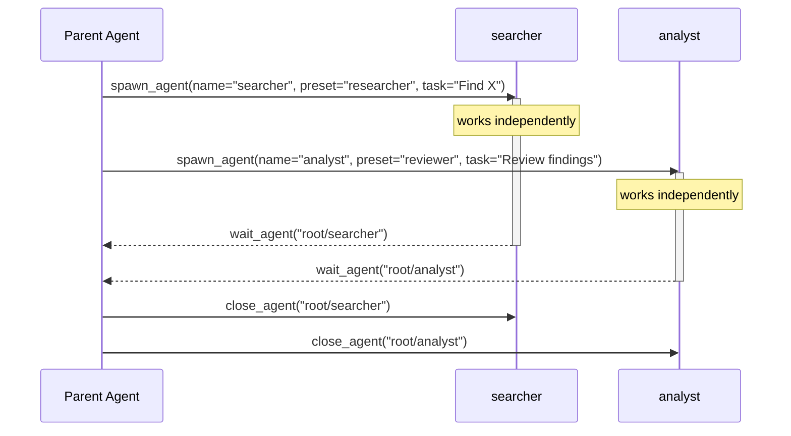

# Multi-Agent

phi-agent supports spawning sub-agents for parallel task execution. This is opt-in behind the `multi-agent` feature flag.

## Overview

Multi-agent allows the main agent to spawn child agents that work independently on sub-tasks. Each sub-agent:

- Has its own system prompt and tool set
- Runs concurrently with the parent and siblings
- Communicates via messages (not shared state)
- Is tracked by name/path for observability

**Enabling multi-agent doesn't mean the agent spawns sub-agents indiscriminately.** The agent decides based on task complexity: simple questions get direct answers, while tasks with independent dimensions (e.g., searching and reviewing simultaneously) may trigger parallel spawning. This is an LLM-driven decision based on the 5 tool definitions — not a hardcoded rule.

You can guide this behavior through the system prompt, for example:

- Encourage parallelism: *"Use sub-agents to search multiple independent sources in parallel"*
- Restrict usage: *"Don't use multi-agent for analysis tasks — handle them directly"*
- Define roles: *"Delegate research tasks to a researcher sub-agent, synthesis tasks to an analyst"* (built-in presets: `researcher` | `coder` | `reviewer` | `tester`)

## Enabling

```toml
[dependencies]
phi-agent = { version = "0.9", features = ["multi-agent"] }
```

Or at runtime:

```bash
cargo run --features multi-agent
```

## Tools

When `multi-agent` is enabled, 5 tools are registered:

| Tool | Description |
|------|-------------|
| `spawn_agent` | Create a sub-agent: `name` + a role via `preset` or `system_prompt`, optionally with its first `task` |
| `send_message` | Send context to a sub-agent; `trigger: true` hands it over as a new task |
| `wait_agent` | Block until a sub-agent completes or the timeout fires |
| `list_agents` | List all active sub-agents |
| `close_agent` | Terminate a sub-agent |

> `followup_task` is deprecated — its trigger semantics moved to
> `send_message(trigger=true)`. It is no longer registered; it will be
> removed from the API in the next breaking release.

### Spawn arguments

| Field | Meaning |
|-------|---------|
| `name` | Unique name; the child's path becomes `root/<name>` |
| `preset` | Built-in role: `researcher` \| `coder` \| `reviewer` \| `tester` (prompt + tool whitelist) |
| `system_prompt` | Custom prompt; overrides a preset's prompt |
| `task` | The first thing the child works on (delivered via its task queue) |
| `fork_history` | Optional parent context: `"none"` (default), `"all"`, or a number of recent turns |

A rejected spawn (sub-agent limit, bad config) returns an **error**, not a
half-created agent — the parent can tell "created" from "rejected". The
success result echoes `spawned_tools`: the tools the child *actually* got
after deployment exclusions, so the parent never assumes a permission the
child lacks.

## Agent lifecycle



Follow-up work on a live agent goes through
`send_message(agent_path, message, trigger=true)`; without `trigger`, the
message is queued as context only and does not start a turn.

## Configuration

```rust
use agent_works::multi_agent::MultiAgentConfig;

let config = MultiAgentConfig {
    max_sub_agents: 10,          // Max live sub-agents
    max_agent_depth: 1,          // Children cannot spawn their own children
    child_read_only: false,      // Suggest children may write (prompt-level nudge)
    child_excluded_tools: vec!["decompose".into()], // root-only tools, hard-excluded
    ..MultiAgentConfig::enabled()
};

let builder = base_agent_builder(llm_client)
    .with_multi_agent(config);
```

Nesting is fixed at one level (`max_agent_depth: 1`): sub-agents are leaves.
Read/write of child tools is a **deployment decision** — the LLM does not
request permissions when spawning.

## Disabling

Multi-agent tools can be removed even when the feature is enabled:

```rust
let builder = base_agent_builder(llm_client)
    .without_multi_agent();  // Remove multi-agent tools
```

## What multi-agent is NOT

- **Not a workflow engine** — no DAG execution, no conditional branching graph. The agent decides when to spawn and what to delegate.
- **Not LangGraph** — no graph compiler, no checkpointing. Sub-agents are managed by the parent agent at runtime.
- **Not preset topologies** — no "manager/worker" or "supervisor" pattern hardcoded. You define the structure through the system prompt.

For complex workflow orchestration, combine phi-agent with LangGraph or Temporal at the application layer.
