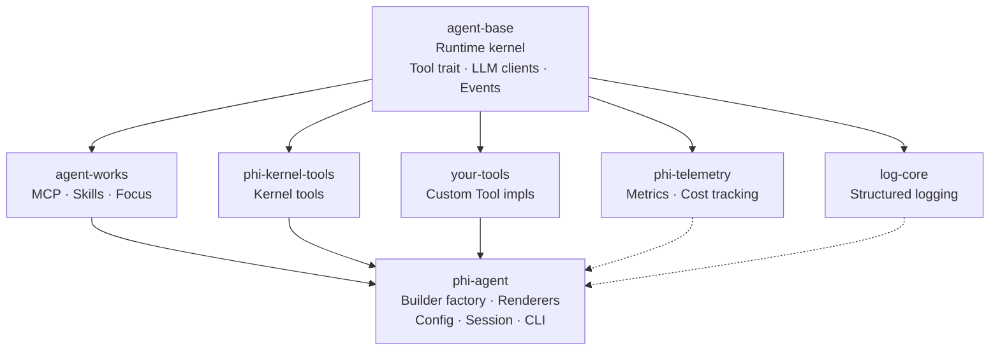

# Architecture

How phi-agent fits together with its dependencies, and why certain decisions were made.

## Repository

Each crate is an independent repository under [hibuka-labs](https://github.com/hibuka-labs):

| Crate | Repository | crates.io |
|-------|-----------|-----------|
| `agent-base` | [hibuka-labs/agent-base](https://github.com/hibuka-labs/agent-base) | ✅ |
| `agent-works` | [hibuka-labs/agent-works](https://github.com/hibuka-labs/agent-works) | ✅ |
| `phi-agent` | [hibuka-labs/phi-agent](https://github.com/hibuka-labs/phi-agent) (this repo) | ✅ |
| `phi-kernel-tools` | [hibuka-labs/phi-kernel-tools](https://github.com/hibuka-labs/phi-kernel-tools) | ✅ |
| `phi-tools` | [hibuka-labs/phi-tools](https://github.com/hibuka-labs/phi-tools) | ✅ |
| `phi-telemetry` | [hibuka-labs/phi-telemetry](https://github.com/hibuka-labs/phi-telemetry) | ✅ |
| `log-core` | [hibuka-labs/log-core](https://github.com/hibuka-labs/log-core) | ✅ |

All crates use pure version dependencies — no monorepo, no path tricks.
`cargo add phi-agent` pulls what you need from crates.io.

## Dependency Chain



## Crate Responsibilities

### agent-base
The runtime kernel — `cargo add agent-base` if you just want the engine:
- `AgentRuntime` — core event loop (LLM chat → tool calls → repeat)
- `Tool` trait — interface all tools implement
- `LlmClient` trait — abstraction over LLM providers
- `RuntimeEvent` — all events emitted during a turn:

| Variant | Trigger | Key fields |
|---------|---------|-------------|
| `TextDelta` | LLM text streaming | `text` |
| `ThoughtDelta` | LLM thinking / reasoning | `text` |
| `ToolCallStarted` | Tool execution begins | `tool_name`, `args_json` |
| `ToolCallFinished` | Tool execution ends (success / error) | `tool_name`, `summary` |
| `AwaitingApproval` | Tool requires user approval | `request` (risk_level, action_key) |
| `PlanUpdated` | Task plan created or updated | `objective`, `plan[]` |
| `UserEvent` | Custom event emitted by tool during execution | `event` (Progress / Structured / SubAgentEvent) |
| `RunFinished` | Turn completed | — |
| `RunCancelled` | Turn cancelled | — |
| `Checkpoint` | State checkpoint (reserved) | `checkpoint` |
- `AgentBuilder` — builder pattern for assembling an agent
- `TurnContext` + `on_turn_end` hook — observability interface (exposes raw data, no metrics logic)

### agent-works
Built on agent-base — `cargo add agent-works` for the toolbox:
- **MCP** — Model Context Protocol support
- **Skills** — plugin/skill system
- **Focus** — structured LLM calls with typed input/output
- **Multi-Agent** — sub-agent spawning and orchestration

### phi-kernel-tools
Kernel primitives behind feature flags. File tools are on by default; shell and multi-agent are opt-in:

| Feature | Capability | Default |
|---------|------------|---------|
| `file` | `read_file`, `write_file`, `list_files` | On |
| `shell` | Execute shell commands | Off |
| `multi-agent` | Spawn sub-agents (`spawn_agent`, `send_message`, etc.) | Off |

### phi-agent (this crate)
Framework layer — `cargo add phi-agent` for the full thing:
- `base_agent_builder()` — pre-configured builder factory
- `PhiAgent` — high-level wrapper around `AgentRuntime`
- `EventRenderer` — Terminal / JSON / Null output formats
- Config resolution, session management, system prompts
- `phi` CLI binary — `cargo install phi-agent`

## Pick what you need

Each crate uses Cargo feature flags to control what gets compiled. Don't need it? Don't compile it.

### agent-works

| Feature | Capability | Default |
|---------|------------|---------|
| `mcp` | MCP protocol support | Off |
| `skill` | Skills plugin system | Off |
| `focus` | Structured LLM calls | Off |
| `multi_agent` | Sub-agent orchestration | Off |
| `full` | Everything | — |

### phi-kernel-tools

| Feature | Capability | Default |
|---------|------------|---------|
| `file` | File read/write tools | On |
| `shell` | Shell command execution | Off |
| `multi-agent` | Sub-agent tools | Off |

### phi-agent

| Feature | Capability | Default |
|---------|------------|---------|
| `file` | File tools + Skills | On |
| `mcp` | MCP protocol | On |
| `focus` | Structured LLM calls | On |
| `shell` | Shell command execution | Off |
| `multi-agent` | Sub-agent orchestration | Off |
| `telemetry` | Metrics collection | On |
| `logging` | Structured logging | On |
| `full` | Everything | — |

### Examples

```toml
# Lightweight: file tools + MCP only
phi-agent = { version = "0.11", default-features = false, features = ["file", "mcp"] }

# Standard: default config (file + MCP + focus + telemetry + logging)
phi-agent = { version = "0.11" }

# Full: everything
phi-agent = { version = "0.11", features = ["full"] }
```

### Telemetry & Observability

phi-agent collects structured metrics automatically. Every session writes a `session_metrics.json`:

- **Per-turn**: tokens, latency breakdown (TTFT, LLM, tool), tool calls, outcome, thinking
- **Per-session**: totals, P50/P95/P99 latency, tool breakdown, error rate, cost estimate
- **Custom extensions**: business logic injects data via `custom` field (e.g. phi-bard tracks prompt version, revision rounds)

```bash
# Built-in CLI
phi metrics list               # table of recent sessions
phi metrics show <session_id>  # detailed breakdown
phi metrics last               # most recent session
```

```json
// session_metrics.json — example
{
  "session_id": "20260729_abc12345",
  "model": "claude-sonnet",
  "total_turns": 5,
  "total_input_tokens": 15000,
  "total_output_tokens": 12000,
  "estimated_cost": 0.18,
  "p50_turn_ms": 32000,
  "p95_turn_ms": 52000,
  "tool_breakdown": { "shell": 5, "check_quality": 3 },
  "outcome": "completed",
  "custom": { "product": "phi-bard", "prompt_version": "v3" }
}
```

**Architecture**: telemetry runs in an independent tokio task, communicating via channel.
Observability panics never crash the agent. agent-base knows nothing about metrics —
it only exposes `TurnContext` data through an `on_turn_end` hook.

**Environment variables**:

| Variable | Default | Description |
|----------|---------|-------------|
| `PHI_METRICS_ENABLED` | `true` | Set to `false` to disable metrics collection |
| `PHI_NODE_ID` | `""` | Node identifier for multi-node deployments |
| `PHI_COST_PER_1K_TOKENS` | built-in | Custom model pricing (`input_cost,output_cost` per 1K tokens) |

See the full [observability design doc](https://github.com/hibuka-labs/phi-agent/blob/master/docs/observability-design.md)
for the complete specification, phi-dash plans, and analysis workflows.

## Key Design Decisions

### Kernel Tools, Not Application Tools
phi-agent provides kernel tools (file I/O, shell, sub-agents) via feature flags — file tools are on by default, shell and multi-agent are opt-in. Ships with zero application tools (no web search, no database connector). Tools are registered externally via `AgentBuilder::register_tool()`.

### File-Based Memory, No Vector DB
phi-agent includes file-based memory (`.phi/memory/`) for persistence across turns, but has no vector database, no embeddings, no semantic search. Every decision is traceable to the prompt.

### Observability by Default
Every session writes `session_metrics.json` automatically. Token usage, latency distribution, tool call stats are all recorded. Use `phi metrics` to view. See [Observability](../advanced/observability.md).

### Session Isolation
Each session has its own directory and file lock, preventing concurrent access from multiple processes. See [Advanced Usage](../advanced/advanced.md).
