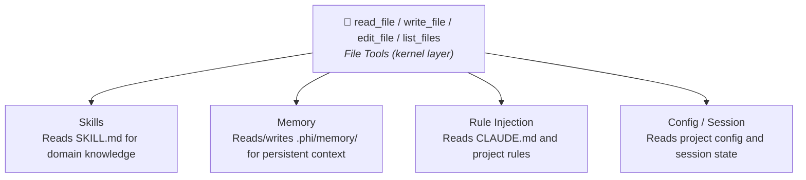

# Kernel Tools

phi-agent provides kernel primitives via feature flags. `file` is on by default; `shell` and `multi-agent` are opt-in:

| Category | Feature | Tools | Default |
|----------|---------|-------|---------|
| File | `file` | `read_file`, `write_file`, `edit_file`, `list_files` | **On** |
| Shell | `shell` | `execute_command` | Off |
| Multi-Agent | `multi-agent` | `spawn_agent`, `send_message`, `followup_task`, `wait_agent`, `list_agents`, `close_agent` | Off |

## Enabling

File tools are enabled by default — no action needed. For shell and multi-agent:

### cargo add

```bash
cargo add phi-agent --features shell,multi-agent
```

### Cargo.toml

```toml
[dependencies]
phi-agent = { version = "0.10", features = ["shell", "multi-agent"] }
```

### Command line

```bash
cargo run --features shell,multi-agent
```

Once enabled, `base_agent_builder()` automatically registers the corresponding tools:

```rust
let builder = base_agent_builder(llm_client)
    .system_prompt(build_system_prompt());
// Kernel tools registered based on enabled features
```

### full feature

`full` enables `file` + `shell` + `mcp` + `telemetry` + `logging` in one shot (excludes `multi-agent` and `browser`):

```bash
cargo run --features full
```

---

## File Tools (`file`)

Provides `read_file`, `write_file`, `edit_file`, `list_files` — the architectural foundation for Skills and Memory.

### Design principles

**Path safety**. All paths are resolved relative to the working directory. Parent directory traversal (`..`) and absolute paths are rejected.

**Size limits**. `read_file` defaults to 2000 lines per call (use `offset`/`limit` for large files). `write_file` defaults to 1MB max per write.

**Precision editing**. `edit_file` replaces exact `old_text`/`new_text` fragments (rather than rewriting the whole file) and requires each `old_text` to be unique in the file.

**Output truncation**. Tool output is truncated to 4000 characters by default (tune via `PHI_MAX_TOOL_OUTPUT_CHARS`); truncated results carry a `...(truncated)` marker.

### Why file tools matter



---

## Shell Tool (`shell`)

Execute shell commands. Opt-in via `--features shell`:

```bash
cargo install phi-agent --features shell
```

---

## Multi-Agent (`multi-agent`)

6 sub-agent orchestration tools. See [Multi-Agent](../advanced/multi-agent.md) for details.

```toml
[dependencies]
phi-agent = { version = "0.10", features = ["multi-agent"] }
```

---

## Custom Kernel Tools

The built-in kernel tools are just a starting point. Implement your own the same way. See [Custom Tools](custom-tool.md).
