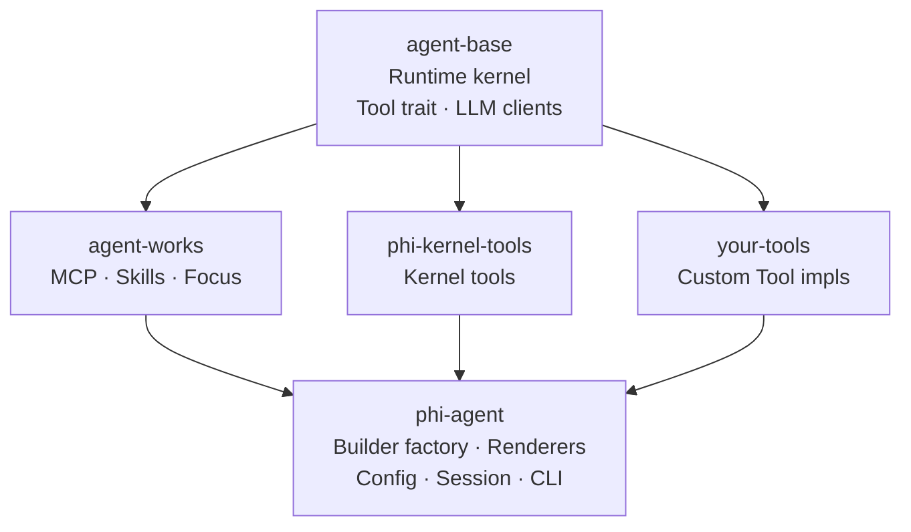

---
hide:
  - toc
  - navigation
---

<h1>
  
  phi-agent
</h1>

<div class="phi-hero" markdown>

**Don't just let AI chat — let it finish the job**

Generic agents are everywhere, but the real work — your work — needs an agent that knows your business. phi-agent is the lightweight runtime foundation for building it — you just write tools and domain prompts, and it finishes the job on its own.

<a href="guide/getting-started/" class="md-button md-button--primary" style="margin-right: 0.5rem">
  :octicons-arrow-right-24: &nbsp; Get Started
</a>
<a href="https://github.com/hibuka-labs/phi-agent" class="md-button" target="_blank">
  :octicons-mark-github-16: &nbsp; View on GitHub
</a>

</div>

---

<div class="grid cards col-1" markdown>

-   :material-rocket-launch-outline:{ .lg .middle } **Minimal kernel, safe and fast**

    ---

    A tool is four methods you implement: `name()`, `description()`, `schema()`, `call()`. Compiles to a single binary — instant startup, no wasted memory. Rust's built-in safety checks mean fewer crashes and leaks. From cloud servers to edge devices, wherever Rust compiles, it runs.

-   :material-chart-line:{ .lg .middle } **Every step, on the record**

    ---

    Every LLM call is logged. Every tool execution leaves a trace. Sessions can be snapshotted, behavior replayed, incidents pinpointed — you build it, you see it.

-   :material-target:{ .lg .middle } **Your domain, your rules**

    ---

    Generic agents know a little about everything — except your business. And you can't change them. No black box. No compromise. No “wait for the next release.” Your experience becomes the prompt, your business becomes the tools — your agent grows out of your domain.

</div>

---

## Ten lines, one agent

Below: the user says *”I feel a bit cold”* — the agent raises the temperature. Your `SmartAc` tool wraps the air conditioner protocol. Your prompt defines the butler. The framework handles the rest.

```rust
let llm = Arc::new(OpenAiClient::new(api_key, “gpt-4o”.into(), None));

let agent = PhiAgent::build(
    base_agent_builder(llm)
        .system_prompt(format!(
            “You control a smart home.\n\n{}”,
            // framework: agent loop
            build_system_prompt()
        ))
        // your tool
        .register_tool(SmartAc),
    PhiAgentConfig::default(),
)?;

let session = agent.create_session().await;
let mut renderer = create_stdout_renderer(&OutputFormat::default());
agent.run_turn(session, “I feel a bit cold”, |e| renderer.render(e)).await?;
```

```bash
cargo add phi-agent
```

Full runnable version: [`examples/minimal/landing.rs`](https://github.com/hibuka-labs/phi-agent/blob/master/examples/minimal/landing.rs).

---

## Architecture



agent-base is the runtime kernel. agent-works extends protocols and skills. phi-kernel-tools provides file and shell primitives. phi-agent assembles them into a ready-to-use framework — you just write tools.

Each crate is a separate repository under [hibuka-labs](https://github.com/hibuka-labs). All built on Rust's async runtime with `Arc<dyn LlmClient>` for provider abstraction. File tools and MCP are on by default; shell and multi-agent are opt-in — see [Kernel Tools](guide/tools/file-tools/) for details.

### Pick what you need

Different businesses, different needs — just the runtime? `cargo add agent-base`. MCP but not Shell? Features come and go as you please. phi-agent doesn't lock you in — if you don't want it, it won't even compile.

```toml
# Lightweight: file tools + MCP only
phi-agent = { version = "0.11", default-features = false, features = ["file", "mcp"] }

# Full: everything
phi-agent = { version = "0.11", features = ["full"] }
```

→ [Full feature list](guide/concepts/architecture/#pick-what-you-need)

## Links

<div class="grid cards" markdown>

-   [:octicons-mark-github-16: GitHub](https://github.com/hibuka-labs/phi-agent)

    Source code, issues, discussions.

-   [:simple-rust: crates.io](https://crates.io/crates/phi-agent)

    Add with `cargo add phi-agent`.

-   [:material-bookshelf: API Docs](https://docs.rs/phi-agent)

    Full Rustdoc on docs.rs.

</div>

---

:material-email-outline: **Contact** &nbsp; [phiagent@hibuka.com](mailto:phiagent@hibuka.com)
