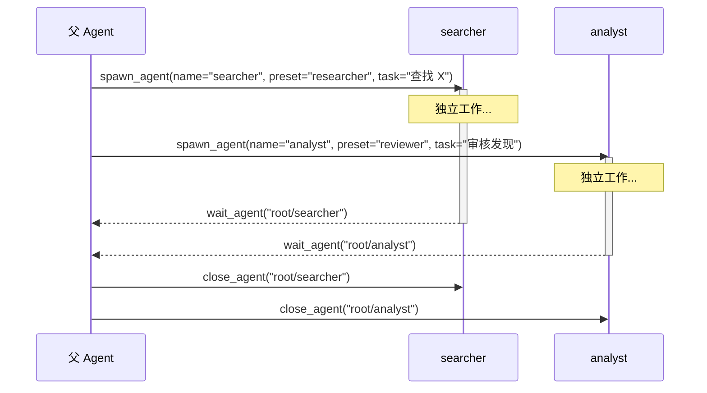

# 多 Agent

phi-agent 支持生成子 Agent 进行并行任务执行。此功能由 `multi-agent` feature flag 控制，需主动开启。

## 概述

多 Agent 允许主 Agent 生成子 Agent，每个子 Agent 独立拥有自己的 system prompt 和工具集
- 与父 Agent 及兄弟 Agent 并发运行
- 通过消息（而非共享状态）通信
- 按名称/路径追踪，便于观测

**启用后，Agent 不会无条件生成子 Agent。** 它会根据任务复杂度自行判断：简单问题直接回答，只有涉及多个独立维度（如同时搜索和审核）时，Agent 才选择并行生成。这是 LLM 基于 5 个工具定义做出的自主决策，不是硬编码的规则。

你可以通过 system prompt 引导这一行为，例如：

- 鼓励并行：*"对于涉及多个独立信息源的问题，使用子 Agent 并行搜索"*
- 限制使用：*"分析类任务不要用多 Agent，直接处理即可"*
- 定义角色：*"将研究类任务委派给 researcher 子 Agent，综合类任务委派给 analyst"*（内置 preset：`researcher` | `coder` | `reviewer` | `tester`）

## 启用方式

```toml
[dependencies]
phi-agent = { version = "0.9", features = ["multi-agent"] }
```

或运行时：

```bash
cargo run --features multi-agent
```

## 工具

启用 `multi-agent` 后，注册 5 个工具：

| 工具 | 说明 |
|------|------|
| `spawn_agent` | 创建子 Agent：`name` + 通过 `preset` 或 `system_prompt` 赋予角色，可同时下达首个 `task` |
| `send_message` | 向子 Agent 发送上下文；`trigger: true` 时作为新任务下发执行 |
| `wait_agent` | 阻塞等待子 Agent 完成或超时 |
| `list_agents` | 列出所有活跃的子 Agent |
| `close_agent` | 终止指定子 Agent |

> `followup_task` 已废弃——触发语义并入 `send_message(trigger=true)`，不再注册，
> 将在下一个破坏性版本中从 API 移除。

### spawn 参数

| 字段 | 含义 |
|------|------|
| `name` | 唯一名称；子 Agent 路径为 `root/<name>` |
| `preset` | 内置角色：`researcher` \| `coder` \| `reviewer` \| `tester`（prompt + 工具白名单） |
| `system_prompt` | 自定义 prompt；与 preset 同时给出时覆盖 preset 的 prompt |
| `task` | 子 Agent 立即执行的首个任务（经任务队列串行投递） |
| `fork_history` | 可选继承父上下文：`"none"`（默认）、`"all"`、或最近 N 轮 |

生成被拒（数量超限、配置非法）时返回**错误**，而不是半个 Agent——父 Agent
可以区分「创建成功」与「被拒绝」。成功结果会回显 `spawned_tools`：子 Agent
在部署期排除规则后**实际**拿到的工具列表，父 Agent 不会误以为子 Agent 拥有
它没有的权限。

## Agent 生命周期



对存活子 Agent 追加工作，走 `send_message(agent_path, message, trigger=true)`；
不带 `trigger` 时消息只作为上下文入队，不会启动新一轮执行。

## 配置

```rust
use agent_works::multi_agent::MultiAgentConfig;

let config = MultiAgentConfig {
    max_sub_agents: 10,          // 最大存活子 Agent 数
    max_agent_depth: 1,          // 子 Agent 不可再生成子 Agent
    child_read_only: false,      // 不附加只读提示（允许子 Agent 写）
    child_excluded_tools: vec!["decompose".into()], // 仅父级可用的工具，硬性排除
    ..MultiAgentConfig::enabled()
};

let builder = base_agent_builder(llm_client)
    .with_multi_agent(config);
```

嵌套固定为一层（`max_agent_depth: 1`）：子 Agent 是叶子节点。
子 Agent 工具的读写是**部署决策**——LLM 在 spawn 时不申请权限。

## 禁用

即使 feature 已启用，也可移除多 Agent 工具：

```rust
let builder = base_agent_builder(llm_client)
    .without_multi_agent();  // 移除多 Agent 工具
```

## 多 Agent 不是什么

- **不是工作流引擎** — 没有 DAG 执行、条件分支图。Agent 自行决定何时生成、委托什么。
- **不是 LangGraph** — 没有图编译器、检查点。子 Agent 由父 Agent 在运行时管理。
- **不是预设拓扑** — 不硬编码"管理者/工作者"或"监督者"模式。你通过 system prompt 定义结构。

需要复杂的工作流编排时，在应用层将 phi-agent 与 LangGraph 或 Temporal 结合使用。
