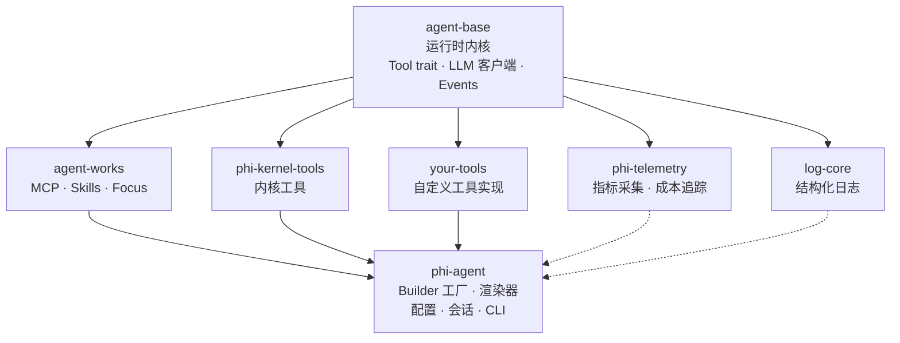

# 架构设计

phi-agent 与依赖 crate 之间的关系，以及关键设计决策。

## 仓库

每个 crate 是独立的 git 仓库，发布到 crates.io：

| Crate | 仓库 | crates.io |
|-------|------|-----------|
| `agent-base` | [hibuka-labs/agent-base](https://github.com/hibuka-labs/agent-base) | ✅ |
| `agent-works` | [hibuka-labs/agent-works](https://github.com/hibuka-labs/agent-works) | ✅ |
| `phi-agent` | [hibuka-labs/phi-agent](https://github.com/hibuka-labs/phi-agent)（本仓库） | ✅ |
| `phi-kernel-tools` | [hibuka-labs/phi-kernel-tools](https://github.com/hibuka-labs/phi-kernel-tools) | ✅ |
| `phi-tools` | [hibuka-labs/phi-tools](https://github.com/hibuka-labs/phi-tools) | ✅ |
| `phi-telemetry` | [hibuka-labs/phi-telemetry](https://github.com/hibuka-labs/phi-telemetry) | ✅ |
| `log-core` | [hibuka-labs/log-core](https://github.com/hibuka-labs/log-core) | ✅ |

所有 crate 使用纯版本依赖 `version = "0.1"`，无 path、无 monorepo。
`cargo add phi-agent` 从 crates.io 拉取所需依赖。

## 依赖链



## 各 Crate 职责

### agent-base
运行时内核 — `cargo add agent-base` 如果只需要引擎：
- `AgentRuntime` — 核心事件循环（LLM 对话 → 工具调用 → 循环）
- `Tool` trait — 所有工具实现的接口
- `LlmClient` trait — LLM 提供商的抽象层
- `RuntimeEvent` — 每轮对话中发出的所有事件：

| 变体 | 触发条件 | 关键字段 |
|------|---------|---------|
| `TextDelta` | LLM 文本流式输出 | `text` |
| `ThoughtDelta` | LLM 思考 / 推理 | `text` |
| `ToolCallStarted` | 工具开始执行 | `tool_name`、`args_json` |
| `ToolCallFinished` | 工具执行结束（成功 / 失败） | `tool_name`、`summary` |
| `AwaitingApproval` | 工具需要用户审批 | `request`（risk_level、action_key） |
| `PlanUpdated` | 任务计划创建或更新 | `objective`、`plan[]` |
| `UserEvent` | 工具执行期间发出的自定义事件 | `event`（Progress / Structured / SubAgentEvent） |
| `RunFinished` | 回合结束 | — |
| `RunCancelled` | 回合取消 | — |
| `Checkpoint` | 状态检查点（预留） | `checkpoint` |
- `AgentBuilder` — 组装 Agent 的构建器模式
- `TurnContext` + `on_turn_end` hook — 可观测性接口

### agent-works
基于 agent-base — `cargo add agent-works` 获取工具箱：
- **MCP** — Model Context Protocol 支持
- **Skills** — 插件/技能系统
- **Focus** — 带类型的结构化 LLM 调用
- **Multi-Agent** — 子 Agent 调度与编排

### phi-kernel-tools
内核原语，通过 feature flag 控制。文件工具默认开启，shell 和多 Agent 按需启用：

| Feature | 能力 | 默认 |
|---------|------|------|
| `file` | `read_file`、`write_file`、`list_files` | 开启 |
| `shell` | 执行 Shell 命令 | 关闭 |
| `multi-agent` | 启动子 Agent（`spawn_agent`、`send_message` 等） | 关闭 |

### phi-agent
框架层 — `cargo add phi-agent` 获取完整功能：
- `base_agent_builder()` — 预配置的构建器工厂
- `PhiAgent` — `AgentRuntime` 的高级封装
- `EventRenderer` — 终端 / JSON / 静默输出
- 配置解析、会话管理、系统提示词
- `phi` CLI — `cargo install phi-agent`

## 按需引入

每个 crate 都通过 Cargo feature flag 控制模块开关，不想要的就不编译。

### agent-works

| Feature | 能力 | 默认 |
|---------|------|------|
| `mcp` | MCP 协议支持 | 关闭 |
| `skill` | Skills 插件系统 | 关闭 |
| `focus` | 结构化 LLM 调用 | 关闭 |
| `multi_agent` | 子 Agent 调度 | 关闭 |
| `full` | 全部开启 | — |

### phi-kernel-tools

| Feature | 能力 | 默认 |
|---------|------|------|
| `file` | 文件读写工具 | 开启 |
| `shell` | Shell 命令执行 | 关闭 |
| `multi-agent` | 子 Agent 工具 | 关闭 |

### phi-agent

| Feature | 能力 | 默认 |
|---------|------|------|
| `file` | 文件工具 + Skills | 开启 |
| `mcp` | MCP 协议 | 开启 |
| `focus` | 结构化 LLM 调用 | 开启 |
| `shell` | Shell 命令执行 | 关闭 |
| `multi-agent` | 子 Agent 调度 | 关闭 |
| `telemetry` | 指标采集 | 开启 |
| `logging` | 结构化日志 | 开启 |
| `full` | 全部功能 | — |

### 组合示例

```toml
# 轻量：只要文件工具 + MCP
phi-agent = { version = "0.11", default-features = false, features = ["file", "mcp"] }

# 标准：默认配置（文件 + MCP + focus + 遥测 + 日志）
phi-agent = { version = "0.11" }

# 全量：全部功能
phi-agent = { version = "0.11", features = ["full"] }
```

### 可观测性

phi-agent 自动采集结构化指标。每个 session 写入 `session_metrics.json`：

- **每轮**：token 用量、延迟分解（TTFT、LLM、工具）、工具调用、结果、thinking
- **每会话**：总计、P50/P95/P99 延迟、工具分布、错误率、费用估算
- **自定义扩展**：业务逻辑通过 `custom` 字段注入数据

```bash
# 内置 CLI
phi metrics list               # 最近会话列表
phi metrics show <session_id>  # 详细分解
phi metrics last               # 最新会话
```

```json
// session_metrics.json — 示例
{
  "session_id": "20260729_abc12345",
  "model": "claude-sonnet",
  "total_turns": 5,
  "total_input_tokens": 15000,
  "total_output_tokens": 12000,
  "estimated_cost": 0.18,
  "p50_turn_ms": 32000,
  "p95_turn_ms": 52000,
  "tool_breakdown": { "shell": 5, "check_quality": 3 },
  "outcome": "completed",
  "custom": { "product": "phi-bard", "prompt_version": "v3" }
}
```

环境变量：

| 变量 | 默认值 | 说明 |
|------|--------|------|
| `PHI_METRICS_ENABLED` | `true` | 设为 `false` 关闭指标采集 |
| `PHI_NODE_ID` | `""` | 多节点部署时的节点标识 |
| `PHI_COST_PER_1K_TOKENS` | 内置 | 自定义模型定价（每千 token 的 `input_cost,output_cost`） |

完整规范、phi-dash 计划和数据分析工作流详见
[可观测性设计文档](https://github.com/hibuka-labs/phi-agent/blob/master/docs/observability-design.md)。

## 关键设计决策

### 内核工具，非应用工具
phi-agent 提供内核工具（文件读写、Shell、子 Agent 调度）通过 feature flag 控制——文件工具默认开启，shell 和多 Agent 按需启用。但不预设任何应用工具（无网页搜索、数据库连接器）。工具通过 `AgentBuilder::register_tool()` 外部注册。

### 文件记忆，无向量库
phi-agent 内置基于文件系统的记忆功能（`.phi/memory/`），但没有向量数据库、embedding、语义搜索。每个决策都可追溯到 prompt。

### 可观测性默认开启
每个 session 自动写入 `session_metrics.json`。Token 消耗、延迟分布、工具调用统计全部记录。`phi metrics` 查看。详见 [可观测性](../advanced/observability.md)。

### 会话隔离
每个会话有独立目录和文件锁，防止多进程并发访问。详见 [高级用法](../advanced/advanced.md)。
