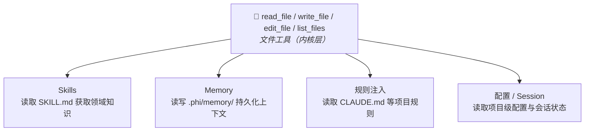

# 内核工具

phi-agent 通过 feature flag 提供内核原语。`file` 默认开启，`shell` 和 `multi-agent` 按需启用：

| 类别 | Feature | 工具 | 默认 |
|------|---------|------|------|
| 文件 | `file` | `read_file`、`write_file`、`edit_file`、`list_files` | **开启** |
| Shell | `shell` | `execute_command` | 关闭 |
| 多 Agent | `multi-agent` | `spawn_agent`、`send_message`、`followup_task`、`wait_agent`、`list_agents`、`close_agent` | 关闭 |

## 启用方式

文件工具默认开启，无需操作。Shell 和多 Agent：

### cargo add

```bash
cargo add phi-agent --features shell,multi-agent
```

### Cargo.toml

```toml
[dependencies]
phi-agent = { version = "0.10", features = ["shell", "multi-agent"] }
```

### 命令行编译

```bash
cargo run --features shell,multi-agent
```

启用后，`base_agent_builder()` 自动注册对应的工具：

```rust
let builder = base_agent_builder(llm_client)
    .system_prompt(build_system_prompt());
// 根据启用的 feature，自动注册内核工具
```

### full 特性

`full` 一次性启用 `file` + `shell` + `mcp` + `telemetry` + `logging`（不含 `multi-agent` 和 `browser`）：

```bash
cargo run --features full
```

---

## 文件工具 (`file`)

提供 `read_file`、`write_file`、`edit_file`、`list_files` 四个工具，是 Skills 和 Memory 的架构基座。

### 设计原则

**路径安全**。所有路径相对工作目录解析，拒绝父目录穿越（`..`）和绝对路径。

**大小限制**。`read_file` 默认每次最多 2000 行（大文件用 `offset`/`limit` 分页）。`write_file` 默认单次最多 1MB。

**精确替换**。`edit_file` 用 `old_text`/`new_text` 精确替换文件片段（而非重写整个文件），并要求每个 `old_text` 在文件中唯一。

**输出截断**。工具输出默认截断到 4000 字符（可用 `PHI_MAX_TOOL_OUTPUT_CHARS` 调整），被截断的结果携带 `...(truncated)` 标记。

### 为什么文件工具很重要



---

## Shell 工具 (`shell`)

执行 Shell 命令。通过 `--features shell` 启用：

```bash
cargo install phi-agent --features shell
```

---

## 多 Agent (`multi-agent`)

6 个子 Agent 调度工具，详见[多 Agent](../advanced/multi-agent.md)。

```toml
[dependencies]
phi-agent = { version = "0.10", features = ["multi-agent"] }
```

---

## 自定义内核工具

内置的内核工具只是一个起点，用同样的方式定制实现你自己的内核工具。详见[自定义工具](custom-tool.md)。
