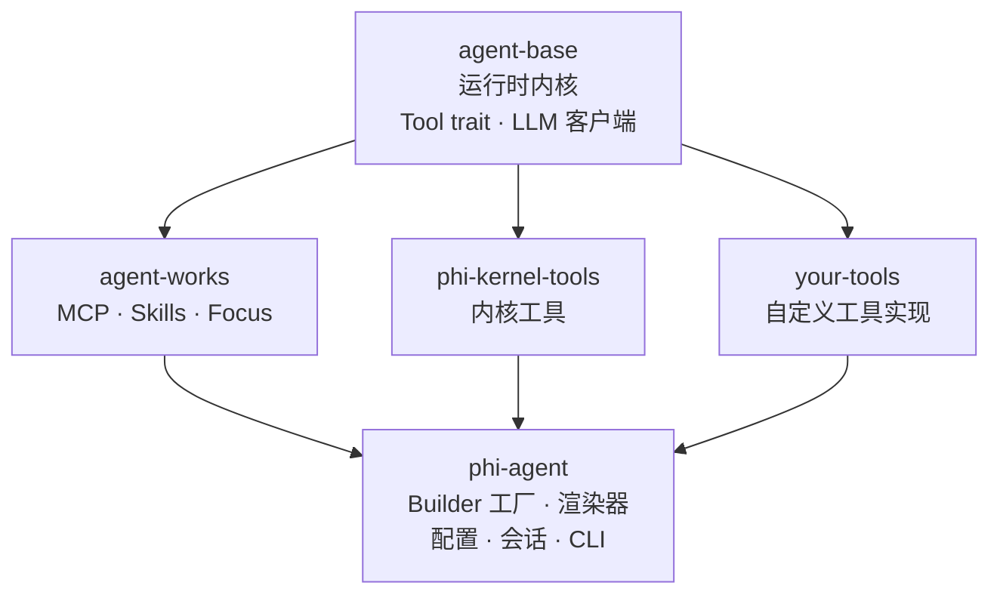

---
hide:
  - toc
  - navigation
---

<h1>
  
  phi-agent
</h1>

<div class="phi-hero" markdown>

**让 AI 不只是聊天，而是把事做完**

通用 Agent 遍地都是，但你业务里的事，只有懂你业务的 Agent 才做得完。phi-agent 就是构建这种 Agent 的轻巧运行时底座——你只要写工具、领域提示词，它就能自主把事做完。

<a href="guide/getting-started/" class="md-button md-button--primary" style="margin-right: 0.5rem">
  :octicons-arrow-right-24: &nbsp; 快速开始
</a>
<a href="https://github.com/hibuka-labs/phi-agent" class="md-button" target="_blank">
  :octicons-mark-github-16: &nbsp; GitHub
</a>

</div>

---

<div class="grid cards col-1" markdown>

-   :material-rocket-launch-outline:{ .lg .middle } **极简内核，安全高效**

    ---

    简单 Rust 内核，一个工具只需 `name()`、`definition()`、`call()` 三个方法，编译出来单一二进制文件，启动不等待，内存不浪费。从云服务器到边缘设备，Rust 能到的地方，它就能跑。

-   :material-target:{ .lg .middle } **你的领域，你做主**

    ---

    通用 Agent 什么都懂一点，唯独不懂你的业务——而且你改不动，没有黑盒，没有将就，没有"等下个版本"。你的经验写进提示词，你的业务做成工具，你的 Agent，从你的领域里长出来。

-   :material-chart-line:{ .lg .middle } **每一步，都有据可查**

    ---

    每一次 LLM 调用都被记录，每一次工具执行都有痕迹，会话可快照、行为可回放、事故可定位——你造的 Agent，你看得见。

</div>

---

## 十行代码，一个 Agent

下面的例子：你说*"我觉得有点冷"*，Agent 就把空调温度调高了，你的 `SmartAc` 工具封装空调协议，你的提示词定义管家角色，框架负责调度。

```rust
let llm = Arc::new(OpenAiClient::new(api_key, "gpt-4o".into(), None));

let agent = PhiAgent::build(
    base_agent_builder(llm)
        .system_prompt(format!(
            "你是一个智能家居管家。\n\n{}",
            // 框架：调度循环
            build_system_prompt()
        ))
        // 你的工具
        .register_tool(SmartAc),
    PhiAgentConfig::default(),
)?;

let session = agent.create_session().await;
let mut renderer = create_stdout_renderer(&OutputFormat::default());
agent.run_turn(session, "我觉得有点冷", |e| renderer.render(e)).await?;
```

```bash
cargo add phi-agent
```

完整可运行版本见 [`examples/minimal/landing.rs`](https://github.com/hibuka-labs/phi-agent/blob/master/examples/minimal/landing.rs)。

---

## 架构



每个 crate 都是 [hibuka-labs](https://github.com/hibuka-labs) 下的独立仓库。基于 Rust 异步运行时，通过 `Arc<dyn LlmClient>` 实现 LLM 提供商抽象。文件工具和 MCP 默认开启，shell 和多 Agent 按需启用 — 详见[内核工具](guide/tools/file-tools/)。

## 链接

<div class="grid cards" markdown>

-   [:octicons-mark-github-16: GitHub](https://github.com/hibuka-labs/phi-agent)

    源码、Issues、讨论。

-   [:simple-rust: crates.io](https://crates.io/crates/phi-agent)

    `cargo add phi-agent` 即可引入。

-   [:material-bookshelf: API 文档](https://docs.rs/phi-agent)

    完整的 Rustdoc 文档。

</div>

---

:material-email-outline: **联系** &nbsp; [phiagent@hibuka.com](mailto:phiagent@hibuka.com)
